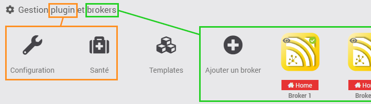
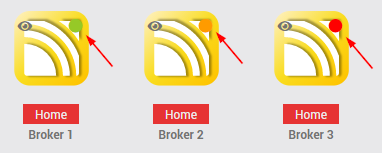
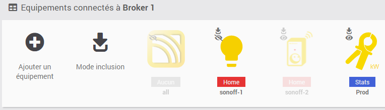
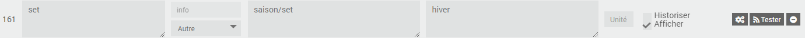
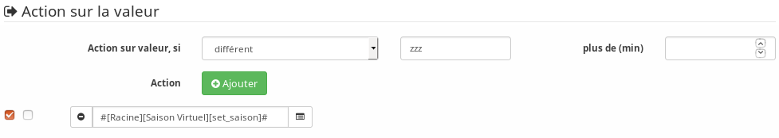
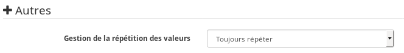

# Présentation

MQTT est un protocole de Publication/Souscription qui est léger, ouvert, simple.  
Il apporte une très grande souplesse dans les échanges d'information entre capteurs/actionneurs/systèmes domotique/etc.

Ce plugin permet de connecter Jeedom à un ou plusieurs serveurs MQTT (appelé Broker) afin de recevoir les messages souscrits et de publier ses propres messages.

Pour comprendre MQTT rapidement, je vous conseille cette vidéo de 4 minutes qui explique les principes de base :  
  
Crédit : François Riotte

Pour en savoir plus, ça se passe en anglais par ici : [MQTT Essentials](https://www.hivemq.com/mqtt-essentials/).

# Démarrage rapide

Par défaut, jMQTT installe le Broker Mosquitto sur la machine hébergeant Jeedom.  
Il vous suffira ensuite de configurer vos modules domotique compatible MQTT pour qu'ils se connectent à ce Broker (IP de votre Jeedom).

La configuration jMQTT est alors très simple:
  1. Installer et activer le plugin en laissant les paramètres par défaut

# Configuration du plugin

> **Important**
> Pour ne pas installer le Broker Mosquitto sur la machine hébergeant Jeedom, commencer par décocher la case *Installer Mosquitto localement*, sans oublier de sauvegarder la configuration.

Après installation du plugin, l’activer. Celui-ci prend quelques minutes pour installer les dépendances. Le suivi détaillé de la progression est possible via le log `jMQTT_dep`.

# Gestion des équipements

Le plugin jMQTT est disponible dans le menu : `Plugins → Protocole domotique → jMQTT`.

jMQTT posséde 2 types d'équipements:
  - les **équipements de type Broker** gérant la connexion avec les Broker MQTT, appelés équipements Broker dans la suite;
  - les **équipements "classiques"**, appélés simplement équipements dans la suite,

Le panneau supérieur gauche, intitulé *Gestion plugin et Broker*, permet de configurer le plugin, et de lister les équipements Broker.  

Sur les équipements Broker, un point de couleur indique l'état de la connexion au Broker :  
  
* Vert: la connexion au Broker est opérationnelle
* Orange: le démon tourne mais la connexion au Broker n'est pas établie
* Rouge: le démon est arrêté

Ensuite, pour chaque Broker, un panneau présente les équipements connectés à celui-ci.  
  
Se trouve également sur ce panneau :
  - Un bouton **+** permettant l'[ajout manuel d'un équipement](#ajout-manuel-dun-équipement);
  - Une icône d'activation du mode [Inclusion automatique des équipements](#inclusion-automatique-des-équipements).

Un équipement :
  - Grisé est inactif
  - Présenté avec une petite icône d’inclusion superposée, est un équipement dont l'*Ajout automatique des commandes* est activé (détails dans [Onglet Equipement](#onglet-equipement))
  - Présenté avec une petite icône d'oeil barré ou non indique qu'il est non visible ou visible

## Equipement Broker
### Ajout

Dans la page de [Gestion des équipements](#gestion-des-équipements), cliquer sur le bouton **+** *Ajouter un Broker* et saisir son nom.

Suite à sa création, un message indique que la commande *status* a été ajoutée à l'équipement. Celle-ci donne l'état de connexion au Broker MQTT de l'équipement Broker. Elle prend 2 valeurs : *online* et *offline*. Elle est publiée de manière persistante auprès du Broker. Cet état permet à un équipement externe à Jeedom de connaitre son statut de connexion. Il peut aussi servir en interne Jeedom pour monitorer la connexion au Broker via un scénario.

### Configuration

Par défaut, un équipement Broker est configuré pour s’inscrire au Broker Mosquitto installé localement. Si cette configuration convient, activer l'équipement et sauvegarder. Revenir sur l'onglet _Broker_, le status du démon devrait passer à OK.

Pour modifier les informations de connexion au Broker, les paramètres sont:
  - _IP/Nom de Domaine du Broker_ : adresse IP du Broker (par défaut localhost i.e. la machine hébergeant Jeedom);
  - _Port du Broker_ : port du Broker (1883 par défaut);
  - _Identifiant de Connexion_ : identifiant avec lequel l'équipement Broker s’inscrit auprès du Broker MQTT (jeedom par défaut).
    - Cet identifiant est aussi utilisé dans les topics des commandes info *status* et *api*. Les topics sont automatiquement mis à jour si l'identifiant est modifié.
  - _Compte et Mot de passe de Connexion_ : compte et mot de passe de connexion au Broker (laisser vide par défaut, notamment si jMQTT se charge de l’installation du Broker).
  - _Topic de souscription en mode inclusion automatique des équipements_ : topic de souscription automatique à partir duquel le plugin va découvrir les équipements, nous y revenons dans la partie équipements (\# par défaut, i.e. tous les topics).
  - _MQTT Sécurisé (TLS)_ : permet le chiffrement TLS des communications avec le Broker. Trois options sont offertes : Désactivé, Activé en utilisant les Autorités Publiques et Activé en utilisant un Autorité Personnalisée. Bien lire le chapitre sur l'utilisation du [Chiffrement TLS](#chiffrement-tls)
  - _Vérifier l'Autorité_ : visible si TLS est activé, vérifie que le certificat du Broker est valide et correspond bien à ce Broker (IP/FQDN & CA).
  - _Autorité Personnalisée_ : visible si TLS est activé et utilise un Autorité Personnalisée, sélectionne l'autorité de certification attendue pour le Broker. Les fichiers disponibles dans la liste déroulante se trouve dans le répertoire data/jmqtt/certs/ du plugin.
  - _Certificat Client Personnalisé_ : visible si TLS est activé, sélectionne le Certificat Client attendu par le Broker. Les fichiers disponibles dans la liste déroulante se trouve dans le répertoire data/jmqtt/certs/ du plugin.
  - _Clé Privée Client Personnalisée_ : visible si TLS est activé, sélectionne la Clée Privée du Client premettant de discuter avec le Broker. Cette clé privée doit être le pendant du Certificat ci-dessus, si l'un est fournit l'autre est obligatoire. Les fichiers disponibles dans la liste déroulante se trouve dans le répertoire data/jmqtt/certs/ du plugin.
  - _Accès API_ : à activer pour utiliser l'[API](#api).

> **Attention**: _L'identifiant de connexion_ doit être unique par client par Broker. Sinon les clients portant le même identifiant vont se déconnecter mutuellement.

Une aide contextuelle est également disponible pour chaque champ.
La sauvegarde de la configuration relance le démon et la souscription au Broker MQTT avec les nouveaux paramètres.

**Info**

 - Dès que l'équipement Broker est activé, son démon est lancé, se connecte au Broker MQTT et traite les messages.
 - Si vous désactivez un équipement Broker, les équipements associés ne recevront et n'enverront plus de messages.
 - En cas de déconnection intempestive au Broker MQTT, le démon tentera immédiatement une reconnexion, puis toutes les 15s.

Chaque équipement Broker possède son propre fichier de log suffixé par le nom de l'équipement. Si l'équipement est renommé, le fichier de log le sera également.

## Equipement
### Inclusion automatique

Le mode inclusion automatique permet la découverte et la création automatique des équipements. Il s’active, pour le Broker concerné, en cliquant sur le bouton *Mode inclusion*. Il se désactive en recliquant sur le même bouton, ou automatiquement après 2 à 3 min.

Le plugin souscrit auprès du Broker le topic configuré dans [l'onglet Broker](#onglet-Broker) (\# par défaut, i.e. tous les topics) de l'équipement Broker concerné. A réception d’un message auquel aucun équipement n’a souscrit, le plugin crée automatiquement un équipement associé au topic de premier niveau.

Prenons comme exemple les messages MQTT suivants :

    boiler/brand "viesmann"
    boiler/burner 0
    boiler/temp 70.0

A l’arrivée du premier message, le plugin crée automatiquement un équipement nommé *boiler*. Nous verrons dans la section [Onglet Commandes](#onglet-commandes) que, par défaut, il créé aussi les informations associées à chaque message.

> **Tip**
>
> Le mode inclusion automatique des équipements n’influe que sur la création de l’équipement, et pas sur la création des informations associées, qui dépend du paramètre *Ajout automatique des commandes* que nous verrons dans le chapitre suivant.

> **Note**
>
> Une fois les équipements découverts, il est conseillé de quitter le mode automatique pour éviter la création d’équipements non souhaités, notamment dans les situations suivantes : publication de messages (si un équipement Broker reste souscrit à tous les topics, il écoutera ses propres publications), essais avec le Broker, tests de nouveaux équipements, …​

### Onglet Equipement

Dans le premier onglet d’un équipement jMQTT, nous trouvons les paramètres communs aux autres équipements Jeedom, ainsi que cinq paramètres spécifiques au plugin :

  - _Broker associé_ : Broker auquel est associé l'équipement. **Attention**: ne modifier ce paramètre qu'en sachant bien ce que vous faites ;

  - _Inscrit au Topic_ : topic de souscription auprès du Broker MQTT. Pour un équipement de type Broker, ce paramètre n'est pas modifiable, il est imposé par l'identifiant de connexion au Broker, voir [Onglet Broker](#onglet-Broker) ;

  - _Ajout automatique des commandes_ : si coché, les [commandes de type information](#commandes-de-type-information) seront automatiquement créés par le plugin, et l’équipement apparaitra avec une petite icône d’inclusion superposé dans la page de [Gestion des équipements](#gestion-des-équipements). La case est cochée par défaut ;

  - _Qos_ : qualité de service souscrit ;

  - _Type d'alimentation_ : paramètre libre vous permettant de préciser le type d'alimentation de l'équipement (non disponible pour un équipement Broker) ;

  - _Dernière communication_ : date de dernière communication avec le Broker MQTT, que ce soit en réception (commande information) ou publication (commande action) ;

  - _Catégorie du topic_ : sélection d’une image spécifique à l’équipement. Pour un équipement Broker, ce paramètre n'est pas disponible car l'image est imposée.

> **Important**
>
> Une fois les commandes créées, il est conseillé de décocher la case *Ajout automatique des commandes* pour éviter la création d’informations non souhaitées.

Concernant les boutons en haut à droite :

  - `Appliquer Template` TODO ;

  - `Créer Template` TODO ;

  - `Dupliquer` permet de [Dupliquer un équipement](#dupliquer-un-équipement).

### Onglet Commandes

#### Commandes de type Information

Les commandes de type information (informations dans la suite) sont créés, automatiquement, uniquement si la case *Ajout automatique des commandes* de l’Onglet Equipement est cochée : lorsque le plugin reçoit un message dont le topic correspond au topic de souscription, il créé alors la commande correspondante lorsque celle-ci est nouvelle.

Voyons cela sur des exemples en fonction du type de payload.

**Payload simple**

Reprenons l’exemple de la payload MQTT publiant les messages simples suivants :

    boiler/brand "viesmann"
    boiler/burner 0
    boiler/temp 70.0
    boiler/ext_temp 19.3
    boiler/hw/setpoint 50
    boiler/hw/temp 49.0

Le plugin créé les informations suivantes :

| Nom         | Sous-Type | Topic              | Valeur   |
| ----------- | --------- | ------------------ | -------- |
| brand       | info      | boiler/brand       | viesmann |
| burner      | info      | boiler/burner      | 0        |
| temp        | info      | boiler/temp        | 70.0     |
| ext\_temp   | info      | boiler/ext\_temp   | 19.3     |
| hw:setpoint | info      | boiler/hw/setpoint | 50       |
| hw:temp     | info      | boiler/hw/temp     | 49.0     |

> **Note**
>
>   * Le nom de la commande est initialisé automatiquement par le plugin à partir du topic. Il peut ensuite être modifié comme souhaité.
>   * Jeedom, dans sa version actuelle, limite la longueur des noms de commande à 45 caractères. Dans le cas de commandes de longueur supérieure, jMQTT remplace leurs noms par leur code de hashage md4 sur 32 caractères (e.g. 5182636929901af7fa5fd97da5e279e1). L’utilisateur devra alors remplacer ces noms par le nommage de son choix.

**Payload JSON**

Dans le cas d’une payload JSON, le plugin sait décoder le contenu et créer les informations associées, et ceci indépendamment de l’état de la case *Ajout automatique des commandes* de l’Onglet Equipement.

Prenons l’exemple de la payload JSON suivante :

    esp/temperatures {"device": "ESP32", "sensorType": "Temperature", "values": [9.5, 18.2, 20.6]}

Au premier message reçu, jMQTT créé automatiquement l’information suivante :

| Nom          | Sous-Type | Topic            | Valeur                                                                          |
| ------------ | --------- | ---------------- | ------------------------------------------------------------------------------- |
| temperatures | info      | esp/temperatures | {"device": "ESP32", "sensorType": "Temperature", "values": \[9.5, 18.2, 20.6\]} |

En basculant dans la vue JSON, via le bouton dédié en haut à droite de la page, et en dépliant complètement l'arbre manuellement, nous obtenons :

| # |   | Nom                      | Sous-Type | Topic                        | Valeur                                                                          |
| - | - |------------------------- | --------- | ---------------------------- | ------------------------------------------------------------------------------- |
| > |   | temperatures             | info      | esp/temperatures             | {"device": "ESP32", "sensorType": "Temperature", "values": \[9.5, 18.2, 20.6\]} |
|   |   |                          | info      | esp/temperatures{device}     | "ESP32"                                                                         |
|   |   |                          | info      | esp/temperatures{sensorType} | "Temperature"                                                                   |
|   | > |                          | info      | esp/temperatures{values}     | \[9.5, 18.2, 20.6\]                                                             |
|   |   |                          | info      | esp/temperatures{values}{0}  | 9.5                                                                             |
|   |   |                          | info      | esp/temperatures{values}{1}  | 18.2                                                                            |
|   |   |                          | info      | esp/temperatures{values}{2}  | 20.6                                                                            |

Seule la première ligne est une commande, reconnaissable parce qu'elle a un id, un nom et des paramètres.

Pour créer des commandes associées à chaque température, il suffit de saisir un nom dans chaque commande (par exemple _temp0_, _temp1_ et _temp2_) et de sauvegarder.

L'affichage bascule dans la vue normale, montrant toutes les commandes de l'équipement ; dans notre cas :

| Nom          | Sous-Type | Topic                        | Valeur                                                                          |
| ------------ | --------- | ---------------------------- | ------------------------------------------------------------------------------- |
| temp0        | info      | esp/temperatures{values}{0}  | 9.5                                                                             |
| temp1        | info      | esp/temperatures{values}{1}  | 18.2                                                                            |
| temp2        | info      | esp/temperatures{values}{2}  | 20.6                                                                            |
| temperatures | info      | esp/temperatures             | {"device": "ESP32", "sensorType": "Temperature", "values": \[9.5, 18.2, 20.6\]} |

Si nous rebasculons dans la vue JSON, nous obtenons alors :

| # |   | Nom                      | Sous-Type | Topic                        | Valeur                                                                          |
| - | - |------------------------- | --------- | ---------------------------- | ------------------------------------------------------------------------------- |
| > |   | temperatures             | info      | esp/temperatures             | {"device": "ESP32", "sensorType": "Temperature", "values": \[9.5, 18.2, 20.6\]} |
|   |   |                          | info      | esp/temperatures{device}     | "ESP32"                                                                         |
|   |   |                          | info      | esp/temperatures{sensorType} | "Temperature"                                                                   |
|   | > |                          | info      | esp/temperatures{values}     | \[9.5, 18.2, 20.6\]                                                             |
|   |   | temp0                    | info      | esp/temperatures{values}{0}  | 9.5                                                                             |
|   |   | temp1                    | info      | esp/temperatures{values}{1}  | 18.2                                                                            |
|   |   | temp2                    | info      | esp/temperatures{values}{2}  | 20.6                                                                            |

> **Note**
>
>   * Le nom des commandes peut être modifié comme souhaité, jMQTT se base sur le champ Topic pour associer la bonne valeur.
>   * Une fois les commandes filles d'une commande JSON créé, il est possible de supprimer la commande mère sans affecter la mise à jour des commandes filles.

#### Commandes de type Action

Les commandes de type action permettent au plugin jMQTT de publier des messages vers le Broker MQTT. Pour cela, créer une commande via le bouton *+ Ajouter une commande action* et remplir les champs selon le besoin :
  - Nom: champ libre ;
  - Valeur par défaut de la commande: pour lier la valeur de la commande affichée sur le dashboard à une commande de type Information (exemple [ici](https://www.jeedom.com/forum/viewtopic.php?f=96&t=32675&p=612364#p602740)) ;
  - Sous-type : voir exemples ci-dessous ;
  - Topic : topic de publication ;
  - Valeur : définit la valeur publiée, i.e. la payload en langage MQTT, voir exemples ci-dessous ;
  - Retain : si coché, la valeur sera persistante (conservée par le Broker et publiée vers tout nouveau souscripteur) ;
  - Qos : niveau de qualité de service utilisé pour publier la commande (1 par défaut).

**Sous-type Défaut**

Les exemples du tableau suivant :

| Nom               | Sous-Type       | Topic             | Valeur                                                         |
| ----------------- | --------------- | ----------------- | -------------------------------------------------------------- |
| set\_hw\_setpoint | action - Défaut | `hw/setpoint/set` | `40`                                                           |
| set\_hw\_setpoint | action - Défaut | `hw/set`          | `{"name": "setpoint", "value": 40}`                            |
| set\_hw\_setpoint | action - Défaut | `hw/set`          | `{"name": "setpoint", "value": #[home][boiler][hw_setpoint]#}` |

Publieront respectivement :

    hw/setpoint/set 40
    hw/set {"name": "setpoint", "value": 40}
    hw/set {"name": "setpoint", "value": 45}

En supposant que `#[home][boiler][hw_setpoint]#` a pour valeur 45.

**Sous-type Curseur**

Les configurations suivantes publieront la valeur saisie via un widget de type curseur :

| Nom               | Sous-Type        | Topic             | Valeur                                    |
| ----------------- | ---------------- | ----------------- | ----------------------------------------- |
| set\_hw\_setpoint | action - Curseur | `hw/setpoint/set` | `#slider#`                                |
| set\_hw\_setpoint | action - Curseur | `hw/set`          | `{"name": "setpoint", "value": #slider#}` |

Soit respectivement, en supposant que la valeur du curseur est 50 :

    hw/setpoint/set 50
    hw/set {"name": "setpoint", "value": 50}

> **Note**
>
> Pour configurer les valeurs min/max de la jauge affichée pour une commande slider, éditer les paramètres avancés de la commande slider (la roue crantée à gauche du bouton **Tester**), aller dans l’onglet **Affichage** et ajouter **minValue** et **maxValue** dans la section **Paramètres optionnels widget** (cette configuration est apportée par le core de Jeedom, elle n’est pas spécifique à jMQTT).

**Sous-type Message**

Pour un message dont le titre est `ecs` et le contenu est `50`, la configuration ci-après publiera :

    boiler {"setpoint": "ecs", "value": 50}

| Nom                | Sous-Type        | Topic    | Valeur                                        |
| ------------------ | ---------------- | -------- | --------------------------------------------- |
| set\_ecs\_setpoint | action - Message | `boiler` | `{"setpoint": "#title#", "value": #message#}` |

**Sous-type Couleur**

La configuration suivante publiera le code couleur sélectionnée via un widget sélecteur de couleur, par exemple :

    room/lamp/color #e63939

| Nom        | Sous-Type        | Topic             | Valeur    |
| ---------- | ---------------- | ----------------- | --------- |
| set\_color | action - Couleur | `room/lamp/color` | `#color#` |

#### Vue Classic, vue JSON

Deux boutons en haut à droite de la page permettent de choisir entre 2 types du vue :
  - La vue **Classic** montre les commandes dans l’ordre d’affichage sur la tuile du Dashboard. Elle permet de les réordonner par glissé/déposé ;
  - La vue **JSON** affiche un arbre hiérarchique permettant de naviguer à l'intérieur des payload JSON, de les déplier/replier, et de créer les commandes information souhaitées (se reporter au paragraphe _Payload JSON_) de la section [Commandes de type Information](#commandes-de-type-information)). Dans cette vue, l’ordonnancement des commandes via glissé/déposé est désactivée.

## Ajout manuel d'un équipement

Il est aussi possible de créer manuellement des équipements jMQTT. Cliquer sur le bouton **+** et saisir le nom de l’équipement. Dans la page [Onglet Equipement](#onglet-equipement), le topic de souscription définit les informations qui seront souscrites par l’équipement.

Pour plus d’information sur les topics MQTT, nous conseillons la lecture de [MQTT Essentials Part 5: MQTT Topics & Best Practices](https://www.hivemq.com/blog/mqtt-essentials-part-5-mqtt-topics-best-practices).

## Dupliquer un équipement

Un équipement peut être dupliqué via le bouton `Dupliquer` situé en haut à gauche de la page de configuration de l’équipement.

Une boite de dialogue demande le nom du nouvel équipement. Sont dupliqués :
  - Tous les paramètres de l’équipement y compris les paramètres de configuration avancés, sauf :
      - Le nom bien sûr ;
      - Le statut *Activer* : l’équipement est désactivé par défaut ;
      - Le topic de souscription qui est laissé vide ;
  - Les commandes de type action y compris leurs paramètres de configuration accessibles via la roue crantée.

> **Important**
>
> Le topic des commandes dupliquées de type action doit être modifié manuellement.

> **Note**
>
> Les commandes de type info ne sont pas dupliquées. Elles seront découvertes automatiquement après définition du topic de souscription et activation de l’équipement, si la case *Ajout automatique des commandes* est cochée.

## Santé du plugin

Le bouton *Santé*, présent dans la page de [Gestion des équipements](#gestion-des-équipements), permet d'afficher l'état de santé des équipements Broker et de leurs équipements

# Chiffrement TLS

L’objectif du MQTTS (Chiffrement des flux MQTT en TLS) est d’établir une communication chiffrée de bout en bout entre un Broker et des clients MQTTS, afin de garantir la confidentialité des échanges.

Il existe de nombreux Broker MQTT gratuits ou payants disponibles en ligne pour connecter un large ensemble d'équipements IoT, par exemple :
 - [AdafruitIO](https://io.adafruit.com/) : Connect your existing project to the Internet to log, stream, and interact with the data it produces.
 - [AWS IoT Core](https://docs.aws.amazon.com/fr_fr/iot/latest/developerguide/mqtt.html) : AWS IoT fournit les services cloud qui connectent vos appareils IoT à d'autres appareils et services cloud AWS.
 - [CloudMQTT](https://www.cloudmqtt.com/) : Hosted message Broker for the Internet of Things.
 - [Google Cloud IoT Core](https://cloud.google.com/iot/docs/how-tos/mqtt-bridge) : Publishing over the MQTT bridge
 - [HiveMQ](https://www.hivemq.com/mqtt-cloud-Broker/) : Connect your MQTT devices to our Cloud Native IoT Messaging Broker.
 - [MaQiaTTo](https://www.maqiatto.com/) : A ready-to-use, online and free MQTT Broker for IoT community.
 - [Microsoft Azure IoT](https://azure.microsoft.com/en-us/documentation/articles/iot-hub-mqtt-support/) : Communication avec votre IoT Hub à l’aide du protocole MQTT.
 - [MyQttHub.com](https://myqtthub.com/en/) : Easily create your MQTT IoT project with MyQttHub.com, an open and scalable Cloud MQTT platform with professional support options.
 - Etc

La grande majorité de ces Broker ne supportent pas de communication "en clair" sur Internet, et demandent la connexion via MQTT over TLS ou MQTTS.
Cela est tout à fait compréhensible, car "en clair" n'importe qui peut en lire le contenu des messages, ou pire, envoyer des messages/ordres à votre place.

Il est aussi possible de configurer son propre Broker pour supporter le MQTTS.
A ce sujet, je vous renvoie vers l'excellent article [MQTTS : Comment utiliser MQTT avec TLS ?](https://openest.io/2019/02/06/chiffrement-communication-mqtt-tls-ssl-mosquitto-et-paho/) [[Version en cache](MQTTS_Openest.pdf)], l'auteur, Julien Grossholtz, n'est nullement associé au plugin jMQTT ou à Jeedom.
**Il s'agit d'une opération complexe, réservé à ceux qui en comprennent les implications et savent utiliser les Certificats.**

Depuis mai 2021, jMQTT supporte la connexion aux Broker publique ou privé en MQTTS. Est aussi implémenté un mecanisme de validation du Certificat du Serveur et l'emploi une paire de clés cryptographique personnalisée (Certificat & Clé Privée Client) pour un chiffrement asymétrique de bout en bout.

# API

Le plugin permet d’accéder à toutes les méthodes de l’[API JSON RPC](https://doc.jeedom.com/fr_FR/core/4.1/jsonrpc_api) au travers du protocole MQTT.

> **Important**
>
> Pour activer l’API :
> 1.  Activer l’accès à l’API jMQTT dans l'[onglet Broker](#onglet-Broker) de l'équipement Broker concerné.
> 2.  Activer l'**API JSON RPC** dans la configuration Jeedom.

Les payloads requêtes doivent être adressées au topic `Identifiant de Connexion/api`, `jeedom/api` par défaut, l’identifiant de connexion étant jeedom par défaut et se configurant via l'[onglet Broker](#onglet-Broker) de l'équipement Broker concerné.

Leur format JSON est :

    {"method": "Méthode de la requête", "id": "Id. de la requête", "params": { Paramètres additionnels }, "topic": "Topic de retour"}

Où :
  - `Méthode de la requête` : nom de la méthode invoquée, voir [API JSON RPC](https://doc.jeedom.com/fr_FR/core/4.1/jsonrpc_api) ;
  - `Id. de la requête` (optionnel) : identifiant qui sera retourné dans la réponse, doit être une chaine. Si absent, l’id de retour sera null ;
  - `Paramètres additionnels` (optionnel) : paramètres relatifs à la méthode de la requête, voir [API JSON RPC](https://doc.jeedom.com/fr_FR/core/4.1/jsonrpc_api) ;
  - `Topic de retour` (optionnel) : topic sous lequel le plugin jMQTT publie la réponse à la requête. Si absent, la réponse n’est pas publiée.

**Exemple :**

Le tableau suivant fournit quelques exemples :

| Requête                                                                                                         | Réponse                                                                                                | Description                                         |
| --------------------------------------------------------------------------------------------------------------- | ------------------------------------------------------------------------------------------------------ | --------------------------------------------------- |
| `{"method":"ping","topic":"retour"}`                                                                            | `{"jsonrpc":"2.0","id":null,"result":"pong"}` sur le topic `retour`                                    | Teste la communication avec Jeedom                  |
| `{"method":"ping","id":"3","topic":"retour"}`                                                                   | `{"jsonrpc":"2.0","id":"3","result":"pong"}` sur le topic `retour`                                     | Teste la communication avec Jeedom                  |
| `{"method":"cmd::execCmd","topic":"emetteur/retour", "id":"a","params":{"id":"798","options":{"slider":"40"}}}` | `{"jsonrpc":"2.0", "id":"a", "result":{"value":"40","collectDate":""}}` sur le topic `emetteur/retour` | Exécute la commande 798: positionne le curseur à 40 |

# FAQ

## Le Broker n'est pas disponible suite à l'installation du plugin

 Il peut arriver que l’installation du plugin se bloque. Cela se produit si le serveur est relancé pendant l’installation (voir log `jMQTT_dep`).
 Pour se débloquer, se connecter au Jeedom et supprimer le fichier `/tmp/jeedom/jMQTT/progress_dep.txt`.

## J'ai changé le niveau de log mais je n'ai pas plus de détails

Si vous changez le niveau de log, le démon doit être relancé.
Pour cela, il faut désactiver puis réactiver l'équipement Broker concerné.

## Le démon se déconnecte avec le message "Erreur sur jMQTT::daemon() : The connection was lost."

Vérifier qu’il n’y a pas 2 clients ayant le même identifiant, voir *Identifiant de connexion* dans l'[onglet Broker](#onglet-Broker) de l'équipement Broker concerné.

# Problèmes inconnus

Les problèmes en cours d’investigation sont sur GitHub : [Issues jMQTT](https://github.com/domochip/jMQTT/issues).

## Quelles données fournir pour investigation en cas de problèmes ?

En cas de problèmes à l’installation, fournir les fichiers de log jMQTT (niveau Debug) et jMQTT\_dep.

En cas de problèmes à l’utilisation, fournir :
  - Le fichier de log `jMQTT`, niveau Debug, le fichier de log `jMQTT_{nom_Broker}` du Broker concerné.
  - Le résultat de la commande suivante :

<!-- end list -->

        mosquitto_sub -h localhost -t "#" -v| xargs -d$'\n' -L1 bash -c 'date "+%Y-%m-%d %T.%3N $0"' | tee /tmp/mosquitto_sub.log

En remplaçant, si besoin, `localhost` par le nom ou l’IP de la machine hébergeant le Broker MQTT concerné.

Si le Broker requiert une authentification, il faudra ajouter `-u username` et `-p password` avant le `-v`.

# Exemples d’utilisation

## Commander un Virtuel via un message MQTT

Supposons un équipement virtuel, appelé *Saison Virtuel*, dont une commande action de sous-type Liste permette de définir la saison (été, hiver). L’objectif est de pouvoir définir cette saison via un message MQTT envoyé par une application externe.

Supposons donc également un équipement jMQTT que nous aurons créé, appelé *Saison\_jMQTT*, souscrivant au topic `saison/#`, dont une commande info est `saison/set`.

Nous souhaitons que lorsqu'une application publie le message `saison/set hiver` sur le Broker, la commande info saison du virtuel soit mise à jour avec *hiver*.

Pour ce faire, il faut créer une deuxième commande action côté virtuel (commande *set\_saison* ci-dessous) qui mette à jour l’information saison du virtuel à partir de celle de l’équipement jMQTT. Le virtuel est donc configuré comme ceci :

Côté équipement jMQTT, nous avons la configuration simple suivante :

Ensuite, il y a deux solutions pour lier les commandes :

  - Créer un scénario avec la commande info `[Saison jMQTT][set]` comme déclencheur, qui exécuterait la commande action `[Saison Virtuel][set_saison]`; ou

  - Configurer une *action sur valeur* en cliquant sur la roue crantée à droite de la commande info `[Saison jMQTT][set]`, onglet *Configuration*:

Attention, quel que soit la solution, il est important de configurer la *Gestion de la répétition des valeurs* de la commande info `[Saison jMQTT][set]` à *Toujours répéter* pour que toutes les valeurs remontent au virtuel. Pour cela, toujours en cliquant sur la roue crantée à droite de cette dernière, onglet *Configuration*:

# Registre des évolutions

[Voir ici](changelog)
