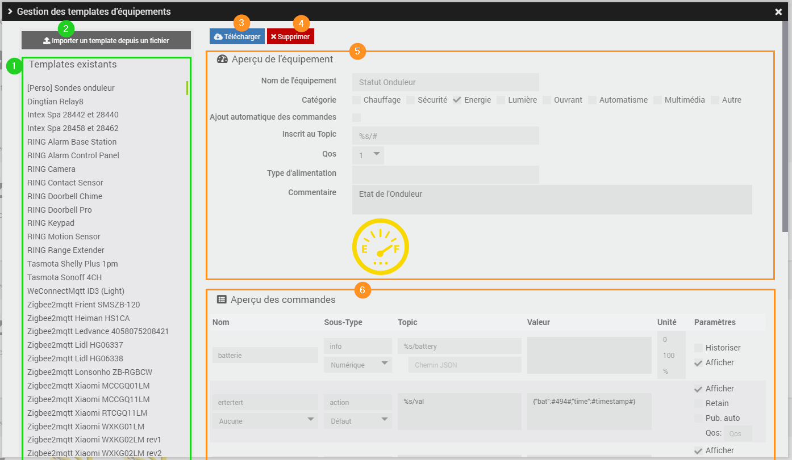
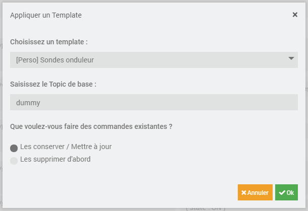

# Présentation

Le plugin jMQTT permet de connecter Jeedom à un ou plusieurs serveurs MQTT (appelé Broker) afin de recevoir les messages souscrits et de publier ses propres messages.
Ses principales fonctionnalités sont :

 - Installation automatique du Broker Mosquitto ;
 - Prise en charge de plusieurs Broker ;
 - Création automatique des équipements MQTT, création automatique des commandes d'information, options pour désactiver ces automatismes ;
 - Ajout manuel d'équipement MQTT ;
 - Duplication d'équipements ;
 - Décodage de payload JSON complexe et création de commandes d'informations associées ;
 - Affichage en vue Classique Jeedom ou en vue JSON ;
 - Ajout manuel de commandes (pour la publication), prise en charge du mode Retain ;
 - Gestionnaire de templates ;
 - Emulation et remontée du niveau de batterie d'un équipement dans Jeedom ;
 - Emulation et remontée de la disponibilité et mise en alarme de l'équipement dans Jeedom ;

et encore beaucoup d'autres...

# Qu'est-ce que MQTT ?

MQTT, pour "Message Queuing Telemetry Transport", est un protocole open source de messagerie qui assure des communications non permanentes entre des appareils par le transport de leurs messages.

Il a été créé en 1999 par Andy Stanford-Clark, ingénieur chez IBM, et Arlen Nipper, chez EuroTech, principalement dans la communication M2M pour permettre à deux appareils utilisant des technologies différentes de communiquer.
"Devenu une norme ISO en 2016, MQTT connectait déjà à cette date des millions d'appareils dans le monde entier, dans toutes sortes d'applications et d'industries. C'est une technologie d'avenir",
affirme Fabien Pereira Vaz, technical sales manager chez Paessler AG.

Les géants du web parmi lesquels AWS ou Microsoft utilisent MQTT pour remonter les données sur leur plateforme cloud.

MQTT est un protocole de Publication/Souscription qui est léger, ouvert, simple.
Il apporte une très grande souplesse dans les échanges d'information entre capteurs/actionneurs/systèmes domotique/etc.

# Comment fonctionne le MQTT ?

Pour comprendre MQTT rapidement, je vous conseille cette vidéo de 4 minutes qui explique les principes de base :

Crédit : François Riotte

Une analogie simple est possible entre le MQTT et la Poste :

- Un **Broker** est un service qui permet de passer les messages MQTT entre des Clients MQTT, il s'agit très souvent du service Mosquitto.
Le Broker est un peu comme un centre postal : c'est par lui que transite le courrier des usagers.

- Un **Client** est une machine qui se connecte à un Broker, il peut Souscrire à un ou plusieurs Topic pour recevoir les Messages (Payload) qui sont envoyés sur ce Topic. Il peut aussi Publier des messages sur des Topics. Il n'est pas nécessaire de souscrire à un Topic pour Publier dessus.
Le Client est un peu comme un usager du service postal : il peut recevoir du courrier à une ou plusieurs adresses (Topic) ou envoyer du courrier à l'adresse d'autres usagers.

- Un **Topic** est une chaine de caractère par convention de la forme nom1/nom2 (/nom3... etc) et permet de représenter la destination du message.

- Un **Message** ou **Payload** est la charge utile transmise sur le Topic, il peut s'agit de texte ou d'un contenu binaire, ou quoi que ce soit d'autre comme format (souvent du Json, XML ou Base64).
L'adresse du destinataire d'un courrier n'est pas le centre postal et le contenu du dernier courrier ne reste pas dans le centre postal. Un Message part uniquement vers les Clients ayant souscrit à ce Topic et étant connectés.

- Un **Message Retain** (Message conservé) a la particularité de rester sur le Broker, tant qu'il n'est pas écrasé par un autre Message Retain. Il est envoyé immédiatement à chaque Client ayant souscrit au Topic associé et est renvoyé à chaque nouveau Client souscrivant au Topic.
Le Message Retain est un peu comme une boite postale qui ne peut contenir qu'un message à la fois : le message reste dans la boite tant qu'aucun autre arrive et peut être consulté par tous ceux qui viennent regarder la boite.

Pour en savoir plus, ça se passe en anglais par ici : [MQTT Essentials](https://www.hivemq.com/mqtt-essentials/).

# Configuration du plugin

Après installation du plugin, il suffit de l’activer sur la page de configuration :

jMQTT est un Client MQTT pour Jeedom, il faut donc un Broker pour pouvoir d'utiliser.
Par défaut, jMQTT n'installe plus le Broker "Mosquitto" sur la machine hébergeant Jeedom pendant l'installation des dépendances.

> **Important**
>
> Si vous n'avez pas encore de Broker et que vous n'utilisez pas un autre plugin qui a déjà installé un Broker, activez l'installation de Mosquitto.
> Pour installer le Broker Mosquitto sur la machine hébergeant Jeedom, il faut cocher la case *Installer Mosquitto localement* et sauvegarder la configuration, puis lancer les dépendances.

Quelques minutes sont nécessaires à l'installation des dépendances. Le suivi de la progression est possible via le log `jMQTT_dep`.

Il suffit ensuite de configurer vos modules domotique compatible MQTT pour qu'ils se connectent à votre Broker (s'il est installé par jMQTT l'IP du Broker est celle votre Jeedom).

C'est aussi sur la page de configuration qu'il est possible d'ajouter et de supprimer des certificats SSL pour les Broker.

# Gestion des équipements

Dans Jeedom, dès que l'on souhaite récupérer ou interagir avec quelque chose, il faut créer un équipement.
Donc, il faut créer un équipement dans jMQTT pour récupérer des données envoyées par d'autre Clients via un Broker.

Le plugin jMQTT est disponible dans le menu : `Plugins → Protocole domotique → jMQTT`.

Le panneau supérieur gauche, intitulé *Gestion*, permet de configurer le plugin :

Détail des différents boutons :
  - Configuration : donne accès à la page de [Configuration du plugin](#configuration-du-plugin);
  - Ajouter un broker : sert à [ajouter un client MQTT](#ajout-manuel-dun-équipement) pour accéder à un nouveau Broker MQTT;
  - Santé : ouvre la [fenêtre de Santé](#santé-du-plugin) de jMQTT;
  - Templates : ouvre la [fenêtre du Gestionnaire de Template](#gestion-des-templates);
  - Ajouter : permet d'[ajouter manuellement un équipement](#ajout-manuel-dun-équipement) lié à un des Broker;
<!--  - Une icône d'activation du mode [Inclusion automatique des équipements](#inclusion-automatique-des-équipements).-->

En-dessous se trouve un champ de recherche, puis un panneau listant les équipements par Broker :

jMQTT possède 2 types d'équipements. Il est très important de faire la distinction entre :
  - les **équipements de type Broker**, qui sont les clients MQTT qui gèrent la connexion avec les Broker MQTT.
On les retrouve toujours en début de section et ils sont facilement identifiables grâce à leur fond jaune et leur icone particulière.
Ils sont souvent appelés **Broker** par abus de langage, ce sera le cas dans la suite de ce document;
  - les **équipements "classiques"**, qui portent les commandes info/action, ils sont simplement appelés **équipement**.

Sur les équipements Broker, un point de couleur indique l'état de la connexion au Broker :

* Vert : le service MQTT est joignable et la communication est opérationnelle
* Orange : le démon n'arrive pas à se connecter au service MQTT, vérifiez les paramètres de configuration
* Rouge : le Broker est désactivé ou le démon est inactif, vérifiez le démon et les paramètres de configuration

A la suite du Broker se trouve tous les équipements rattachés à celui-ci.

Un équipement :
  - Grisé est inactif
  - Présenté avec une petite icône d'oeil barré ou non indique qu'il est non visible ou visible
  - Présenté avec une petite icône d’inclusion superposée, est un équipement dont l'*Ajout automatique des commandes* est activé (détails dans [Onglet Equipement](#onglet-equipement))

Il existe également une vue sous forme de table (TableView) :

Elle s'active en cliquant sur le bouton tout à droite du champ de recherche (dans l'encadré rouge ci-dessus).

En plus de retrouver dans cette vue les informations classiques (icone, objet, nom, s'il est activé), des icones à droite permettent de retrouver rapidement des informations importantes.
  - Sur un Broker, on retrouvera 3 informations : son statut (OK, POK, NOK), s'il est visible et s'il est en inclusion automatique,
  - Sur un Equipement, on retrouvera 5 informations : son statut d'activation, s'il est visible, s'il est en inclusion automatique, son état de batterie et son état de disponibilité.

Enfin tout à droite, il est possible d'accéder directement à la "Configuration avancée" de l'équipement.

## Equipement Broker
### Ajout

Dans la page de [Gestion des équipements](#gestion-des-équipements), cliquer sur le bouton **+** *Ajouter un Broker* et saisir son nom.

Suite à sa création, un message indique que la commande *status* a été ajoutée à l'équipement.
Celle-ci donne l'état de connexion au Broker MQTT de l'équipement Broker. Elle prend 2 valeurs : *online* et *offline*.
Elle est publiée de manière persistante auprès du Broker. Cet état permet à un équipement externe à Jeedom de connaitre son statut de connexion.
Il peut aussi servir en interne Jeedom pour monitorer la connexion au Broker via un scénario.

### Configuration

Par défaut, un équipement Broker est configuré pour s’inscrire au Broker Mosquitto installé localement.
Si cette configuration convient, activer l'équipement et sauvegarder. Revenir sur l'onglet _Broker_, le statut du démon devrait passer à OK.

Pour modifier les informations de connexion au Broker, les paramètres sont :
  - Section _Paramètres d'accès au Broker_ (encadré 1)
    - _Adresse du broker_ :
      - Protocole utilisé pour communiquer avec le Broker :
        - _mqtt_ pour des communications en clair,
        - _mqtts_ pour activer le chiffrement (TLS) des communications avec le Broker.
          Une fois cette option sélectionnée il sera possible de configurer les Certificats utilisés dans la partie de droite.
      - Adresse IP ou nom de domaine du Broker : (par défaut localhost i.e. la machine hébergeant Jeedom);
      - Port du Broker : port du Broker (1883 par défaut en mqtt et 8883 en mqtts);
    - _Authentification_ : compte et mot de passe de connexion au Broker (laissez le champ vide si vous n'avez pas configuré votre Broker MQTT en conséquence, notamment si jMQTT se charge de l’installation du Broker).
    - _Identifiant/ClientId_ : identifiant avec lequel l'équipement Broker s’inscrit auprès du Broker MQTT (jeedom par défaut).
      Cet identifiant est aussi utilisé dans le topic de la commande info *status*. Le topic est automatiquement mis à jour si l'identifiant est modifié.
    - _Publier le statut_ : active/désactive la publication du statut de connexion de cet équipement Broker en MQTT sur le Broker.
    - _Topic de souscription en mode inclusion_ : topic de souscription automatique à partir duquel le plugin va découvrir les équipements, nous y revenons dans la partie équipements (\# par défaut, i.e. tous les topics).

  - Section _Paramètres de Sécurité_ (encadré 2), bien lire le chapitre sur l'utilisation du [Chiffrement TLS](#chiffrement-tls) :
    - Cette section apparait uniquement si le protocole mqtts est sélectionné
    - _Vérifier le certificat_ : vérifie que le certificat du Broker est valide et correspond bien à ce Broker (IP/FQDN & CA).
       Trois options sont offertes : Désactivé, Activé en utilisant les Autorités Publiques et Activé en utilisant un Autorité Personnalisée.
    - _Autorité Personnalisée_ : visible si utilise un Autorité Personnalisée, sélectionne l'autorité de certification attendue pour le Broker.
    - _Certificat Client_ : sélectionne le Certificat Client attendu par le Broker.
    - _Clé Privée Client_ : visible si Certificat Client rempli, sélectionne la Clé Privée du Client permettant de discuter avec le Broker.
      Cette clé privée client est le pendant du certificat client ci-dessus, si l'un est fourni l'autre est obligatoire.

> **Attention**: _L'identifiant de connexion_ doit être unique par client par Broker. Sinon les clients portant le même identifiant vont se déconnecter mutuellement.

Une aide contextuelle est également disponible pour chaque champ.
La sauvegarde de la configuration relance le client MQTT et la souscription au Broker MQTT avec les nouveaux paramètres.
Il est aussi possible de relancer volontairement le client MQTT avec le bouton _(Re)Démarrer_ (encadré 3) en haut de la page.

**Info**

 - Dès que l'équipement Broker est activé, le démon se connecte au Broker MQTT et traite les messages.
 - Si vous désactivez un équipement Broker, les équipements associés ne recevront et n'enverront plus de messages.
 - En cas de déconnection intempestive au Broker MQTT, le démon tentera immédiatement une reconnexion, puis toutes les 15s.

Chaque équipement Broker possède son propre fichier de log (encadré 4) suffixé par le nom de l'équipement.
Si l'équipement est renommé, le fichier de log le sera également.

Le mode inclusion automatique (encadré 5) permet la découverte et la création automatique des équipements.
Il s’active, pour le Broker concerné, en cliquant sur le bouton *Mode inclusion* en haut à droite sur l'équipement Broker.
Il se désactive en recliquant sur le même bouton, ou automatiquement après environ 3 minutes.

## Equipement

Le plugin souscrit auprès du Broker le topic configuré dans [l'onglet Broker](#onglet-Broker) (\# par défaut, i.e. tous les topics) de l'équipement Broker concerné. 
A réception d’un message auquel aucun équipement n’a souscrit, le plugin crée automatiquement un équipement associé au topic de premier niveau.

Prenons comme exemple les messages MQTT suivants :

    boiler/brand "viesmann"
    boiler/burner 0
    boiler/temp 70.0

A l’arrivée du premier message, le plugin crée automatiquement un équipement nommé *boiler*. Nous verrons dans la section [Onglet Commandes](#onglet-commandes) que, par défaut, il créé aussi les informations associées à chaque message.

> **Tip**
>
> Le mode inclusion automatique des équipements n’influe que sur la création de l’équipement, et pas sur la création des informations associées, qui dépend du paramètre *Ajout automatique des commandes* que nous verrons dans le chapitre suivant.

> **Note**
>
> Une fois les équipements découverts, il est conseillé de quitter le mode automatique pour éviter la création d’équipements non souhaités, notamment dans les situations suivantes : publication de messages (si un équipement Broker reste souscrit à tous les topics, il écoutera ses propres publications), essais avec le Broker, tests de nouveaux équipements, …​

### Onglet Equipement

Dans le premier onglet d’un équipement jMQTT, nous trouvons les paramètres communs aux autres équipements Jeedom, ainsi que cinq paramètres spécifiques au plugin :

  - _Broker associé_ : Broker auquel est associé l'équipement. **Attention**: ne modifier ce paramètre qu'en sachant bien ce que vous faites ;

  - _Inscrit au Topic_ : topic de souscription auprès du Broker MQTT. Pour un équipement de type Broker, ce paramètre n'est pas modifiable, il est imposé par l'identifiant de connexion au Broker, voir [Onglet Broker](#onglet-Broker) ;

  - _Ajout automatique des commandes_ : si coché, les [commandes de type information](#commandes-de-type-information) seront automatiquement créés par le plugin, et l’équipement apparaitra avec une petite icône d’inclusion superposé dans la page de [Gestion des équipements](#gestion-des-équipements). La case est cochée par défaut ;

  - _Qos_ : qualité de service souscrit ;

  - _Type d'alimentation_ : paramètre libre vous permettant de préciser le type d'alimentation de l'équipement (non disponible pour un équipement Broker) ;

  - _Commande d'état de la batterie_ : commande de l'équipement qui sera utilisée comme niveau de batterie. Si la commande info est de type binaire, alors la valeur de la batterie sera 10% (0) ou 100% (1). Si la commande info est de type numérique, alors la valeur sera utilisée comme pourcentage de batterie (non disponible pour un équipement Broker) ;

  - _Commande de disponibilité_ : commande de l'équipement (info binaire) qui sera utilisée comme état de disponibilité de l'équipement. Si cette commande est à 0, alors l'équipement sera remonté en erreur "Danger" (non disponible pour un équipement Broker) ;

  - _Dernière communication_ : date de dernière communication avec le Broker MQTT, que ce soit en réception (commande information) ou publication (commande action) ;

  - _Catégorie du topic_ : sélection d’une image spécifique à l’équipement. Pour un équipement Broker, ce paramètre n'est pas disponible car l'image est imposée.

> **Important**
>
> Une fois les commandes créées, il est conseillé de décocher la case *Ajout automatique des commandes* pour éviter la création d’informations non souhaitées.

Concernant les boutons en haut à droite :

  - `Appliquer template` permet d'[Appliquer un template existant à l'équipement en cours](#application-dun-template-sur-un-équipement) ;
  - `Créer template` permet de [Créer un template à partir de l'équipement en cours](#création-dun-template-depuis-un-équipement) ;
  - `Modifier Topics` permet de Modifier en masse tous les topics de l'équipement courant (pensez à sauvegarder l'équipement après la modification) ;
  - `Dupliquer` permet de [Dupliquer un équipement](#dupliquer-un-équipement).

### Onglet Commandes

#### Commandes de type Information

Les commandes de type information (informations dans la suite) sont créés, automatiquement, uniquement si la case *Ajout automatique des commandes* de l’Onglet Equipement est cochée : lorsque le plugin reçoit un message dont le topic correspond au topic de souscription, il créé alors la commande correspondante lorsque celle-ci est nouvelle.

Voyons cela sur des exemples en fonction du type de payload.

**Payload simple**

Reprenons l’exemple de la payload MQTT publiant les messages simples suivants :

    boiler/brand "viesmann"
    boiler/burner 0
    boiler/temp 70.0
    boiler/ext_temp 19.3
    boiler/hw/setpoint 50
    boiler/hw/temp 49.0

Le plugin créé les informations suivantes :

| Nom         | Sous-Type | Topic              | Valeur   |
| ----------- | --------- | ------------------ | -------- |
| brand       | info      | boiler/brand       | viesmann |
| burner      | info      | boiler/burner      | 0        |
| temp        | info      | boiler/temp        | 70.0     |
| ext\_temp   | info      | boiler/ext\_temp   | 19.3     |
| hw:setpoint | info      | boiler/hw/setpoint | 50       |
| hw:temp     | info      | boiler/hw/temp     | 49.0     |

> **Note**
>
>   * Le nom de la commande est initialisé automatiquement par le plugin à partir du topic. Il peut ensuite être modifié comme souhaité.
>   * Jeedom limite la longueur des noms de commande à 127 caractères depuis la version 4.1.17, 45 caractères avant. Dans le cas de commandes de longueur supérieure, jMQTT remplace leurs noms par leur code de hashage md4 sur 32 caractères (par exemple 5182636929901af7fa5fd97da5e279e1). L’utilisateur devra alors remplacer ces noms par le nommage de son choix.
>   * Lorsqu'un Payload binaire (ne correspondant pas à du texte) est reçu, jMQTT essaye dans un premier temps de le décompresser en zlib et de le convertir en texte. S'il n'y parvient pas ou que le résultat reste binaire, alors cette valeur binaire est envoyée envoyée dans la commande information encodée en base64.

**Payload JSON**

Dans le cas d’une payload JSON, le plugin sait décoder le contenu et créer les informations associées, et ceci indépendamment de l’état de la case *Ajout automatique des commandes* de l’Onglet Equipement.

Le champ "Chemin JSON" est utilisé pour sélectionner l'information à extraire. Il s'agit d'un chemin JSON suivant le [format JSONPath](https://goessner.net/articles/JsonPath/), à travers l'implémentation de [Galbar](https://github.com/Galbar/JsonPath-PHP). Ce format est un outil très puissant pour analyser, transformer et extraire sélectivement des données à partir de structures JSON, à l’image de XPath pour le XML.

Voici un aperçu du langage et des possibilités qu'il renferme :

| JSONPath         | Description                                                                    |
| ---------------- | ------------------------------------------------------------------------------ |
| $                | Objet/élément racine                                                           |
| @                | Objet/élément courant                                                          |
| . or []          | Operateur de sélection d'un enfant                                             |
| ..               | Descente récursive                                                             |
| *                | Caractère générique : tous les objets/éléments indépendamment de leurs noms    |
| []               | Opérateur d'indice : opérateur natif d'un tableau                              |
| [,]              | Opérateur d'union : noms alternatifs ou indices de tableau en tant qu'ensemble |
| [start:end:step] | Opérateur de découpage de tableau                                              |
| ?()              | Expression (script) de filtrage de données                                     |

Le premier caractère '$' est omis par la vue JSON de jMQTT dans un souci de lisibilité, mais le Chemin JSON reste parfaitement fonctionnel que le caractère '$' soit présent ou non.

Prenons l’exemple de la payload JSON suivante :

    esp/temperatures {"device": "ESP32", "sensorType": "Temp", "values": [9.5, 18.2, 20.6]}

Au premier message reçu, jMQTT créé automatiquement l’information suivante :

| Nom          | Sous-Type | Topic            | Chemin JSON    | Valeur                                                                            |
| ------------ | --------- | ---------------- | -------------- | --------------------------------------------------------------------------------- |
| temperatures | info      | esp/temperatures |                | {"device": "ESP32", "sensorType": "Temp", "values": \[9.5, 18.2, 20.6\]}   |

En basculant dans la vue JSON, via le bouton dédié en haut à droite de la page, et en dépliant complètement l'arbre manuellement, nous obtenons :

| # |   | Nom          | Sous-Type | Topic            | Chemin JSON     | Valeur                                                                   |
| - | - | ------------ | --------- | ---------------- | --------------- | ------------------------------------------------------------------------ |
| > |   | temperatures | info      | esp/temperatures |                 | {"device": "ESP32", "sensorType": "Temp", "values": \[9.5, 18.2, 20.6\]} |
|   |   |              | info      | esp/temperatures | \[device\]      | "ESP32"                                                                  |
|   |   |              | info      | esp/temperatures | \[sensorType\]  | "Temp"                                                                   |
|   | > |              | info      | esp/temperatures | \[values\]      | \[9.5, 18.2, 20.6\]                                                      |
|   |   |              | info      | esp/temperatures | \[values\]\[0\] | 9.5                                                                      |
|   |   |              | info      | esp/temperatures | \[values\]\[1\] | 18.2                                                                     |
|   |   |              | info      | esp/temperatures | \[values\]\[2\] | 20.6                                                                     |

Seule la première ligne est une commande, reconnaissable parce qu'elle a un id, un nom et des paramètres.

Pour créer des commandes associées à chaque température, il suffit de saisir un nom dans chaque commande (par exemple _temp0_, _temp1_ et _temp2_) et de sauvegarder.

L'affichage bascule dans la vue normale, montrant toutes les commandes de l'équipement ; dans notre cas :

| Nom          | Sous-Type | Topic            | Chemin JSON      | Valeur                                                                          |
| ------------ | --------- | ---------------- | ---------------- | ------------------------------------------------------------------------------- |
| temp0        | info      | esp/temperatures | \[values\]\[0\]  | 9.5                                                                             |
| temp1        | info      | esp/temperatures | \[values\]\[1\]  | 18.2                                                                            |
| temp2        | info      | esp/temperatures | \[values\]\[2\]  | 20.6                                                                            |
| temperatures | info      | esp/temperatures |                  | {"device": "ESP32", "sensorType": "Temp", "values": \[9.5, 18.2, 20.6\]} |

Si nous rebasculons dans la vue JSON, nous obtenons alors :

| # |   | Nom          | Sous-Type | Topic            | Chemin JSON     | Valeur                                                                   |
| - | - | ------------ | --------- | ---------------- | --------------- | ------------------------------------------------------------------------ |
| > |   | temperatures | info      | esp/temperatures |                 | {"device": "ESP32", "sensorType": "Temp", "values": \[9.5, 18.2, 20.6\]} |
|   |   |              | info      | esp/temperatures | \[device\]      | "ESP32"                                                                  |
|   |   |              | info      | esp/temperatures | \[sensorType\]  | "Temp"                                                                   |
|   | > |              | info      | esp/temperatures | \[values\]      | \[9.5, 18.2, 20.6\]                                                      |
|   |   | temp0        | info      | esp/temperatures | \[values\]\[0\] | 9.5                                                                      |
|   |   | temp1        | info      | esp/temperatures | \[values\]\[1\] | 18.2                                                                     |
|   |   | temp2        | info      | esp/temperatures | \[values\]\[2\] | 20.6                                                                     |

> **Note**
>
>   * Le nom des commandes peut être modifié comme souhaité, jMQTT se base sur le champ Topic pour associer la bonne valeur.
>   * Une fois les commandes filles d'une commande JSON créé, il est possible de supprimer la commande mère sans affecter la mise à jour des commandes filles.

#### Commandes de type Action

Les commandes de type action permettent au plugin jMQTT de publier des messages vers le Broker MQTT. Pour cela, créer une commande via le bouton *+ Ajouter une commande action* et remplir les champs selon le besoin :

  - Nom: champ libre ;
  - Valeur par défaut de la commande: pour lier la valeur de la commande affichée sur le dashboard à une commande de type Information (exemple [ici](https://www.jeedom.com/forum/viewtopic.php?f=96&t=32675&p=612364#p602740)) ;
  - Sous-type : voir exemples ci-dessous ;
  - Topic : topic de publication ;
  - Valeur : définit la valeur publiée, i.e. la payload en langage MQTT, voir exemples ci-dessous ;
  - Retain : si coché, la valeur sera persistante (conservée par le Broker et publiée vers tout nouveau souscripteur) ;
  - Pub. Auto : si coché, le champ Valeur sera automatiquement calculé et publié sur le Topic lors du changement d'une commande info du champ Valeur ;
  - Qos : niveau de qualité de service utilisé pour publier la commande (1 par défaut).

**Sous-type Défaut**

Les exemples du tableau suivant :

Publieront respectivement :

    hw/setpoint/set 40
    hw/set {"name": "setpoint", "value": 40}
    hw/set {"name": "setpoint", "value": 45}

En supposant que `#[home][boiler][hw_setpoint]#` a pour valeur 45.

**Sous-type Curseur**

Les configurations suivantes publieront la valeur saisie via un widget de type curseur :

Soit respectivement, en supposant que la valeur du curseur est 50 :

    hw/setpoint/set 50
    hw/set {"name": "setpoint", "value": 50}

> **Note**
>
> Pour configurer les valeurs min/max de la jauge affichée pour une commande slider, éditer les paramètres avancés de la commande slider (la roue crantée à gauche du bouton **Tester**), aller dans l’onglet **Affichage** et ajouter **minValue** et **maxValue** dans la section **Paramètres optionnels widget** (cette configuration est apportée par le core de Jeedom, elle n’est pas spécifique à jMQTT).

**Sous-type Message**

Pour un message dont le titre est `ecs` et le contenu est `50`, la configuration ci-après publiera :

    boiler {"setpoint": "ecs", "value": 50}

**Sous-type Couleur**

La configuration suivante publiera le code couleur sélectionnée via un widget sélecteur de couleur :

Publiera pour une couleur rouge clair selectionnée :

    room/lamp/color #e63939

#### Vue Classic, vue JSON

Deux boutons en haut à droite de la page permettent de choisir entre 2 types du vue :
  - La vue **Classic** montre les commandes dans l’ordre d’affichage sur la tuile du Dashboard. Elle permet de les réordonner par glissé/déposé ;
  - La vue **JSON** affiche un arbre hiérarchique permettant de naviguer à l'intérieur des payload JSON, de les déplier/replier, et de créer les commandes information souhaitées (se reporter au paragraphe _Payload JSON_) de la section [Commandes de type Information](#commandes-de-type-information)). Dans cette vue, l’ordonnancement des commandes via glissé/déposé est désactivée.

## Ajout manuel d'un équipement

Il est aussi possible de créer manuellement des équipements jMQTT. Cliquer sur le bouton **+** et saisir le nom de l’équipement. Dans la page [Onglet Equipement](#onglet-equipement), le topic de souscription définit les informations qui seront souscrites par l’équipement.

Pour plus d’information sur les topics MQTT, nous conseillons la lecture de [MQTT Essentials Part 5: MQTT Topics & Best Practices](https://www.hivemq.com/blog/mqtt-essentials-part-5-mqtt-topics-best-practices).

## Dupliquer un équipement

Un équipement peut être dupliqué via le bouton `Dupliquer` situé en haut à gauche de la page de configuration de l’équipement.

Une boite de dialogue demande le nom du nouvel équipement. Sont dupliqués :
  - Tous les paramètres de l’équipement y compris les paramètres de configuration avancés, sauf :
      - Le nom bien sûr ;
      - Le statut *Activer* : l’équipement est désactivé par défaut ;
      - Le topic de souscription qui est laissé vide ;
  - Les commandes de type action y compris leurs paramètres de configuration accessibles via la roue crantée.

> **Important**
>
> Le topic des commandes dupliquées de type action doit être modifié manuellement.

> **Note**
>
> Les commandes de type info ne sont pas dupliquées. Elles seront découvertes automatiquement après définition du topic de souscription et activation de l’équipement, si la case *Ajout automatique des commandes* est cochée.

## Santé du plugin

Le bouton *Santé*, présent dans la page de [Gestion des équipements](#gestion-des-équipements), permet d'afficher une vue de la santé des Broker et des équipements :

Les informations présentes sont : le nom, l'ID, le Topic de souscription, la date de Dernière communication, la Date de création, l'état des Brokers, ainsi que le nombre de commande sur chaque équipement.

# Gestion des templates

jMQTT met à disposition de l'utilisateur une solution simple pour appliquer un modèle prédéfini (template) à un équipement.
Les templates conservent toutes les commandes d'origine, leurs configurations et leurs paramètres avancés.

Dans un permier temps, il est possible de [créer](#création-dun-template-depuis-un-équipement) ou d'[appliquer](#application-dun-template-sur-un-équipement) un template à un équipement existant, celà se passe directement sur un équipement :

Ensuite, le gestionnaire de Template est présent dans la section *Gestion* de la page principale du plugin. Il permet d'ajouter, de télécharger et de supprimer des templates et d'en visualiser les commandes.

Dans le gestionnaire, on distingue différentes sections :
  1. La liste des templates existants.

Ceux préfixés par `[Perso]` sont liés à votre installation, les autres arrivent directement avec jMQTT.
Si vous souhaitez mettre à disposition vos templates, n'hésitez pas à [ouvrir un ticket sur GitHub](https://github.com/Domochip/jMQTT/issues).

  2. Un bouton d'import de template dans jMQTT depuis un fichier json.

Lorsqu'un template est selectionné dans la liste, la partie de droite est renseignée :

  3. Un bouton permettant le téléchargement du template selectionné sur votre ordinateur.
  4. Un bouton pour supprimer le template selectionné (uniquement pour les templates `Perso`).
  5. Une prévisualisation de l'équipement et ses paramètres.
  6. Une prévisualisation des commandes disponibles et leurs paramètres.

## Création d'un template depuis un équipement

La seule information à renseigner est le nom que vous souhaitez donner à votre template.

Une fois la fenêtre validée, un nouveau template est disponible sur le système et peut être utilisé.

## Application d'un template sur un équipement

Quand on souhaite appliquer un template, 3 informations sont attendues :

  - Le template à appliquer ;
  - Le topic de base qui sera utilisé pour spécialiser les commandes et la souscription de l'équipement ;
  - Si les commandes existantes doivent être conservées (celles avec un nom présent dans la template seront écrasées), ou si tout l'équipement doit être vidé de ses commandes préalablement.

Une fois la fenêtre validée, l'équipement est modifié et peut être utilisé.

# Chiffrement TLS

L’objectif du MQTTS (Chiffrement des flux MQTT en TLS) est d’établir une communication chiffrée de bout en bout entre un Broker et des clients MQTTS, afin de garantir la confidentialité des échanges.

Il existe de nombreux Broker MQTT gratuits ou payants disponibles en ligne pour connecter un large ensemble d'équipements IoT, par exemple :
 - [AdafruitIO](https://io.adafruit.com/) : Connect your existing project to the Internet to log, stream, and interact with the data it produces.
 - [AWS IoT Core](https://docs.aws.amazon.com/fr_fr/iot/latest/developerguide/mqtt.html) : AWS IoT fournit les services cloud qui connectent vos appareils IoT à d'autres appareils et services cloud AWS.
 - [CloudMQTT](https://www.cloudmqtt.com/) : Hosted message Broker for the Internet of Things.
 - [Google Cloud IoT Core](https://cloud.google.com/iot/docs/how-tos/mqtt-bridge) : Publishing over the MQTT bridge
 - [HiveMQ](https://www.hivemq.com/mqtt-cloud-Broker/) : Connect your MQTT devices to our Cloud Native IoT Messaging Broker.
 - [MaQiaTTo](https://www.maqiatto.com/) : A ready-to-use, online and free MQTT Broker for IoT community.
 - [Microsoft Azure IoT](https://azure.microsoft.com/en-us/documentation/articles/iot-hub-mqtt-support/) : Communication avec votre IoT Hub à l’aide du protocole MQTT.
 - [MyQttHub.com](https://myqtthub.com/en/) : Easily create your MQTT IoT project with MyQttHub.com, an open and scalable Cloud MQTT platform with professional support options.
 - Etc

La grande majorité de ces Broker ne supportent pas de communication "en clair" sur Internet, et demandent la connexion via MQTT over TLS ou MQTTS.
Cela est tout à fait compréhensible, car "en clair" n'importe qui peut en lire le contenu des messages, ou pire, envoyer des messages/ordres à votre place.

Il est aussi possible de configurer son propre Broker pour supporter le MQTTS.
A ce sujet, je vous renvoie vers l'excellent article [MQTTS : Comment utiliser MQTT avec TLS ?](https://openest.io/2019/02/06/chiffrement-communication-mqtt-tls-ssl-mosquitto-et-paho/) [[Version en cache](MQTTS_Openest.pdf)], l'auteur, Julien Grossholtz, n'est nullement associé au plugin jMQTT ou à Jeedom.
**Il s'agit d'une opération complexe, réservé à ceux qui en comprennent les implications et savent utiliser les Certificats.**

Depuis mai 2021, jMQTT supporte la connexion aux Broker publique ou privé en MQTTS. Est aussi implémenté un mecanisme de validation du Certificat du Serveur et l'emploi une paire de clés cryptographique personnalisée (Certificat & Clé Privée Client) pour un chiffrement asymétrique de bout en bout.

# FAQ

## Le Broker n'est pas disponible suite à l'installation du plugin

 Il peut arriver que l’installation du plugin se bloque. Cela se produit si le serveur est relancé pendant l’installation (voir log `jMQTT_dep`).
 Pour se débloquer, se connecter au Jeedom et supprimer le fichier `/tmp/jeedom/jMQTT/progress_dep.txt`.

## J'ai changé le niveau de log mais je n'ai pas plus de détails

Si vous changiez le niveau de log, le démon devait être relancé dans les anciennes version.
Pour cela, il fallait désactiver puis réactiver l'équipement Broker concerné.
Aujourd'hui, le démon est automatiquement informé que le niveau de log a changé et les nouveaux logs arrivent.

## Le démon se déconnecte avec le message "Erreur sur jMQTT::daemon() : The connection was lost."

Vérifier qu’il n’y a pas 2 clients ayant le même identifiant, voir *Identifiant de connexion* dans l'[onglet Broker](#onglet-Broker) de l'équipement Broker concerné.

# Problèmes inconnus

Les problèmes en cours d’investigation sont sur GitHub : [Issues jMQTT](https://github.com/domochip/jMQTT/issues).

## Quelles données fournir pour investigation en cas de problèmes ?

En cas de problèmes à l’installation, fournir les fichiers de log jMQTT (niveau Debug) et jMQTT\_dep.

En cas de problèmes à l’utilisation, passer le plugin et les Broker en niveau de log `Debug` reproduire le problème et fournir :
  - Des captures d'écran ds pages Santé de Jeedom (avec les liste des autres plugins isntallés) et de jMQTT,
  - Tous les fichiers de log commençant par `jMQTT`,
  - Le nom du/des Broker concerné(s),
  - Le résultat de la commande suivante pour chaque Broker concerné (fichier `/tmp/diag_jmqtt.log`) :

<!-- end list -->

        mosquitto_sub -h localhost -v -t "#" | xargs -d$'\n' -L1 bash -c 'date "+%Y-%m-%d %T.%3N $0"' | tee /tmp/diag_jmqtt.log

En remplaçant, si besoin, `localhost` par le nom ou l’IP de la machine hébergeant le Broker MQTT.
Si une authentification est requise, ajouter `-u username` et `-p password` avant le `-v`.

# Exemples d’utilisation

## Commander un Virtuel via un message MQTT

Supposons un équipement virtuel, appelé *Saison Virtuel*, dont une commande action de sous-type Liste permette de définir la saison (été, hiver). L’objectif est de pouvoir définir cette saison via un message MQTT envoyé par une application externe.

Supposons donc également un équipement jMQTT que nous aurons créé, appelé *Saison\_jMQTT*, souscrivant au topic `saison/#`, dont une commande info est `saison/set`.

Nous souhaitons que lorsqu'une application publie le message `saison/set hiver` sur le Broker, la commande info saison du virtuel soit mise à jour avec *hiver*.

Pour ce faire, il faut créer une deuxième commande action côté virtuel (commande *set\_saison* ci-dessous) qui mette à jour l’information saison du virtuel à partir de celle de l’équipement jMQTT. Le virtuel est donc configuré comme ceci :

Côté équipement jMQTT, nous avons la configuration simple suivante :

Ensuite, il y a deux solutions pour lier les commandes :

  - Créer un scénario avec la commande info `[Saison jMQTT][set]` comme déclencheur, qui exécuterait la commande action `[Saison Virtuel][set_saison]`; ou

  - Configurer une *action sur valeur* en cliquant sur la roue crantée à droite de la commande info `[Saison jMQTT][set]`, onglet *Configuration*:

Attention, quel que soit la solution, il est important de configurer la *Gestion de la répétition des valeurs* de la commande info `[Saison jMQTT][set]` à *Toujours répéter* pour que toutes les valeurs remontent au virtuel. Pour cela, toujours en cliquant sur la roue crantée à droite de cette dernière, onglet *Configuration*:

## Conservation de l'état précédant une coupure de courant (exemple commande action avec "Retain")

Les Messages Retain ont beaucoup d'intérêt pour renvoyer des valeurs à la reconnexion d'un périphérique.

Par exemple, une prise connectée Sonoff sera OFF de base après une coupure de courant.

Si on souhaite remettre la prise dans le dernier état avant la coupure, il peut être intéressant de passer les commandes action d'allumage/extinction de la prise dans jMQTT en Retain.

En effet, publier le message ON et OFF en Retain permet d'assurer qu'à la reconnexion au Broker, le Broker l’informe directement du dernier état demandé et la prise revient en ON si c’était le cas. (Il faut bien publier ON et OFF en retain dans ce cas, pour que le Broker envoie aussi OFF si elle était OFF, car un message non-Retain n’écrase pas la valeur Retain dans le Broker).

# Registre des évolutions

[Evolutions de la branche beta](changelog_beta)

[Evolutions de la branche stable](changelog)

[Evolutions archivées](changelog_archived)

# Documentations

[Documentation de la branche beta](index_beta)

[Documentation de la branche stable](index)
